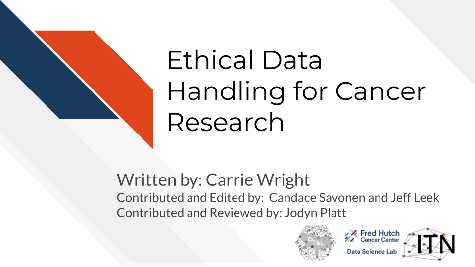

# Introduction

## Motivation

One of the key cancer informatics challenges is dealing with and managing the explosion of data from multiple sources. This course is designed to help researchers and investigators to understand the key ethical principles of data management from a privacy, security, usability and discoverability perspective. 

## Target Audience 

This course is intended for researchers (including postdocs and students) with limited to intermediate experience with informatics research. The conceptual material will also be useful for those in management roles who are collecting data and using informatics pipelines.

## Topics Covered

## Curriculum 

The course will cover the key underlying principles and concepts in data management. It will also cover data security, data privacy, IRB and data access requests, and the ethics of good data management. 

