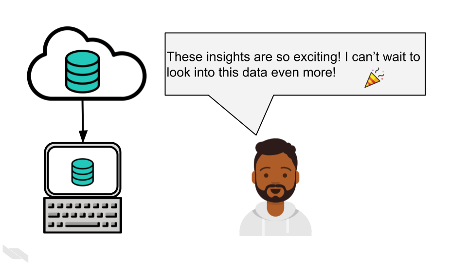
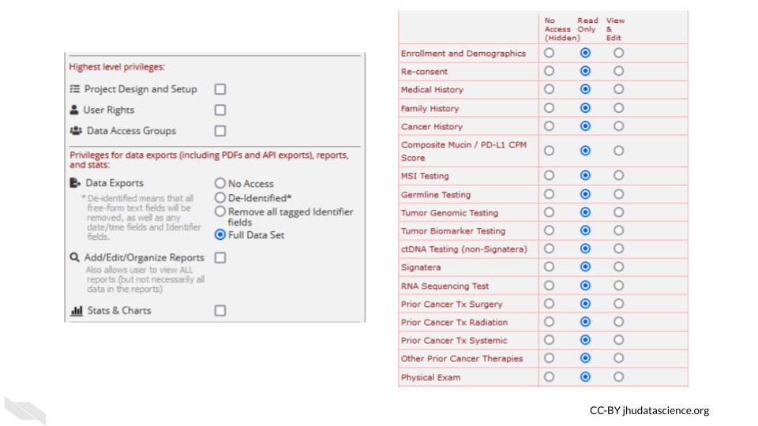
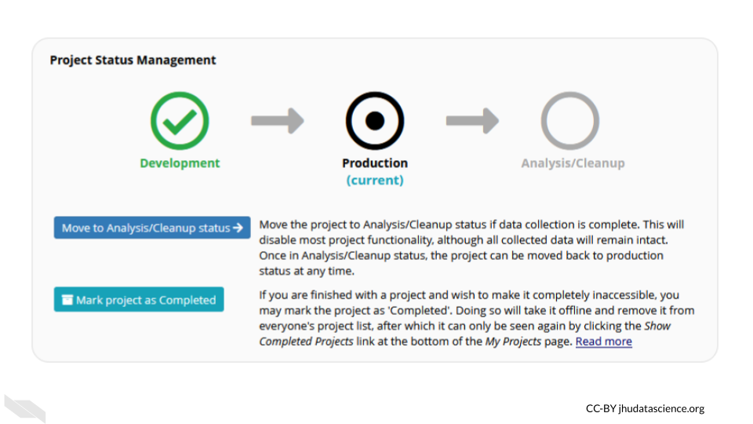

# Data Sharing

In this chapter we will discuss the importance of data sharing, best practices for data sharing, places where you can store your data, as well as methods to share data in contexts in which you might have thought sharing was not possible! 

## Data sharing is important!

Sharing data is critical for optimizing the advancement of scientific understanding. Now that labs all over the world are producing massive amounts of data, there are many discoveries that can be made by just using this existing data.

This is so important, that starting in January, 2023 the NIH will require specific sharing practices for data management and sharing. See the announcement [here](https://grants.nih.gov/grants/guide/notice-files/NOT-OD-21-013.html).

See this [course](https://hutchdatascience.org/NIH_Data_Sharing/) for more information about how to comply with this policy. 

Note that many institutes and funding agencies or mechanisms have requirements about how your data can be shared. Typically data sharing of protected data also requires Institutional Review Board (IRB) approval before the study is conducted. Ensure that you are following those requirements before you share your data.

There's so many excellent reasons to put your data in a repository whether or not a journal requires it:  

**Sharing your data...**  

1. Makes your project more transparent and thus more likely to be trusted and cited. In fact one study found that articles with links to the data used (in a repository) were cited more than articles without such information or other forms of data sharing [@colavizza_citation_2020].

2. Helps your relieve your own workload so your email inbox isn't loaded by requests you probably don't have time to respond to.

3. Allows others to gain even more insights from your data which shows funders that your data will be used to its maximum potential.

## Data repositories

The best way to share your data is by putting it somewhere that others can download it (and it can be kept private when necessary). There's many repositories out there that handle this for you.

Below are some of the standard repositories for data you should consider.

**For a longer list of repositories, we also advise consulting this [Nature guidance on data repositories](https://www.nature.com/sdata/policies/repositories).**

### Genomic Data Repositories

- [National Center for Biotechnology Information (NCBI)](https://www.ncbi.nlm.nih.gov/)
  - For microarray: [GEO Gene Expression Omnibus (GEO)](https://www.ncbi.nlm.nih.gov/geo/info/submission.html)
  - For RNA-seq: [SRA (Sequencing Read Archive)](https://www.ncbi.nlm.nih.gov/sra/docs/submit/)
- [European Molecular Biology Laboratory-European Bioinformatics Institute (EMBL-EBI)](https://www.ebi.ac.uk/submission/)
- [International Nucleotide Sequence Databases—DNA Data Bank of Japan (DDBJ)](https://www.ddbj.nig.ac.jp/ddbj/submission-e.html)

### Imaging data repositories

- [Imaging data resource](https://idr.openmicroscopy.org/)
- [Cancer imaging archive](https://www.cancerimagingarchive.net/primary-data/)

### Repositories for journal articles

For manuscripts or large datasets that are of atypical format, using one of these repositories is a good idea.
The journal you submit to may have a recommendation of one over another. If not, you might end up having a preference.

- [CyVerse Data Commons Repository](https://cyverse.org/data-commons)
- [Data Dryad](https://datadryad.org/stash)
- [FigShare](https://help.figshare.com/article/how-to-upload-and-publish-your-data)
- [ZENODO](https://help.zenodo.org/)

### Small datasets

Data sets that are small and atypical format can be published as supplementary files as a part of a manuscript.

## Data Submission tips

Uploading a dataset to a data repository is a great step toward sharing your data! But, the dataset uploaded is unclear and unusable it might as well not been uploaded in the first place.

Keep in mind that although you may understand the ins and outs of your dataset and project, its likely that others who look at your data will not understand your notation.

To make your data truly shared, you need to take the time to make sure it is well-organized and well-described!
There are two files you should make sure to include to help describe and organize your data project:

- [A main README file](https://jhudatascience.org/Reproducibility_in_Cancer_Informatics/documenting-analyses.html#readmes) that orients others to what is included in your data.
- A metadata file that samples that are included, how they are connected, and when appropriate following privacy ethics, describes clinical features.
  - [Standards for genomic metadata](https://genestack.com/assets/pdfs/The%20importance%20of%20metadata%20in%20genomics%20and%20the%20FAIR%20principles%20ebook.pdf)

### Use consistent and clear names

- Make sure that sample and data IDs used are consistent across the project - make sure to include a metadata file that describes in detail your samples in a way that is clear without any prior knowledge of the project.
- Sample and data IDs should keep with standard formatting otherwise known in the field.
- Features names should avoid using genomic coordinates as these may change with new genome versions.

### Make your project reproducible

Reproducible projects are able to be re-run by others to obtain the same results.

**The main requirements for a reproducible project are:**

- The data can be freely obtained from a repository (this maybe summarized data for the purposes of data privacy).
- The code can be freely obtained from GitHub (or another similar repository).
- The software versions used to obtain the results are made clear by documentation or providing a Docker container.
- The code and data are well described and organized with a system that is consistent.

### Have someone else review your code and data!

The best way to find out if your data are useable by others is to have someone else look it over!
There are so many little details that go into your data and projects. Those details can easily lead to typos and errors upon data submission and also can lead to confusion when others (or your future self) are attempting to use that data.The best way to test if your data project is usable is to have someone else (who has not prepared the data) is able to make sense of it.

For more details on how to make data and code reproducible tips, see our [Intro to Reproducibility](https://www.itcrtraining.org/courses#h.ugabyqq1bigx) course.

## Health care data sharing tools

<!-- https://www.ncbi.nlm.nih.gov/pmc/articles/PMC8178732/?report=classic -->
<!-- Amazon Comprehend -->
<!-- Healthcare Cost and Utilization Project (HCUP) -->

### REDCap (Research Electronic Data Capture)

[REDCap](https://www.project-redcap.org/) is a very widely used browser-based software application for managing surveys and databases. It is very often used for clinical data. In fact, it is so widely used that there is a [conference](https://i2b2transmart.org/redcapcon2022/) dedicated to it. 

REDCap allows for multi-institutional work, as well as compliance with HIPAA, [21 CFR Part 11](https://www.ecfr.gov/current/title-21/chapter-I/subchapter-A/part-11) for data for the FDA, [FISMA](https://www.techtarget.com/searchsecurity/definition/Federal-Information-Security-Management-Act) for government data, HIPAA, and [GDPR](https://gdpr-info.eu/) for data for the European Union. It was developed by a team at Vanderbilt University in 2004. It is not open-source, however it is free to use for non-commercial research [@redcap_2022]. 

You can find out more about how to use REDCap at the [REDCap website](https://projectredcap.org/) which includes instructional [videos](https://projectredcap.org/resources/videos/) and other resources. 

There are several things to keep in mind when using REDCap from an ethical standpoint.

1) Roles

REDCap allows for various roles to be established for users on a project. Thus access to certain data and tasks can be restricted to certain individuals. As described previously, it is a good idea to restrict access to the smallest number of individuals necessary. 

You can modify these roles using the `User Rights` menu.

This will first show you who has what role on the project and their rights. You can click on an individual role to modify it.

These roles should be verified by your institutional review board (IRB) before beginning a study. Changes to roles should also be reviewed by your IRB.

2) Reports

Reports that are exported can be customized to only show data that should be shared with the individual that you plan to share with. Please see the section on [de-identification](https://jhudatascience.org/Ethical_Data_Handling_for_Cancer_Research/data-security.html#de-identification) to better understand what data you might want to be restrictive about sharing. Again, the way you intend to share your data should be reviewed by your IRB before you begin your study.

For example, you might remove the dates from the following report:

3) Auditing

REDCap keeps track of all data modifications, as well as data exports or report generations, in addition to keeping track of who performs those actions. This can be helpful for checking what has happened and when, in case anything happens that is unexpected or unintended. This is also great from a reproducibility or transparency standpoint - you have a record of any modifications to the data. This information can be obtained from the `logging` menu.

4) Keep instruments short

If your instruments are too long, this can result in accidentally sharing data that you don't intend to, simply because you have more data to sift through. This also makes it easier to generate reports only on specific data that you would like to share.

5) Data can be locked

You can protect your data from accidentally being modified by locking specific data. Furthermore, at later stages of the project the data can no longer be modified. 

<!-- Scott Carey can help with this section maybe -->

Keep in mind that your institution likely has their own guidelines for how to use REDCap should you decide to use it. Also remember to verify what you plan to do with your institutional review board (IRB) before you begin the study.

## Summary

In summary, in this chapter we covered the following concepts:

- Data sharing is important for advancing scientific understanding, transparency, and maximizing the value of your data.
- There are many data repositories where you can store and share your data, including general repositories like Data Dryad and FigShare, and repositories specific to certain data types like genomics or imaging data.
- When sharing data, be sure to organize and document your data well with things like a README file, consistent naming conventions, and metadata. Follow reproducibility practices whenever possible. 
- Tools like REDCap can help manage clinical data while ensuring security, privacy, and reproducibility through features like role-based access controls, data auditing, and locking data after collection. 
- Checking with your IRB first before sharing data, sharing code, or using new tools can help ensure that data is shared and accessed responsibly. Ideally such plans should be reviewed by your IRB before you begin a study. It is often possible to safely publicly share the code used to analyze protected data, as long as you don't reveal aspects of the the data in code. Your local IRB may be able to help you learn how to do so. 

