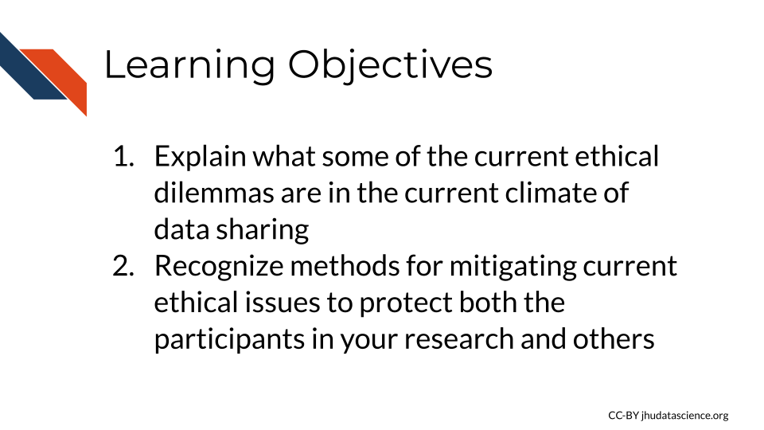

# Current Data Concerns

Given rapid changes in technology, data ethics is also rapidly evolving. Now we cover some of the current concerns for cancer research.

## Current Ethical Issues

There are several current issues that researchers and research participants, and really all individuals engaging in health care face. We are facing new and bigger ethical issues in data due to:

- Increasing practice of reusing data (and in ways that are new), which means consent processes cannot fully describe risks and benefits
- Large scale data collection which sometimes doesn't involve consent, often this is done by companies for other reasons (for example, to create an AI tool that can distinguish images, a company may by coincidence also collect images of faces)
- New data sharing technologies provides increasing opportunities for security failures

We will discuss some of these new issues briefly.

### Consent for Data Reuse

One major current ethical issue that we face now, is the consequences of the reuse of shared data. As we have described, there are major benefits of sharing data. It can allow researchers to really maximize their efforts. However, there are also negative potential consequences as well. Furthermore, it is still unclear what is exactly possible with our data, for both good and bad uses, as technology continues to advance.

Previous management strategies for informed consent originate from research that predates the large scale data sharing that we now use today. In those cases, informed consent was a bit more straight forward to achieve. Now that data is often reused more often, it is often less obvious how data will be used for research purposes in the future, thus it is less obvious how to inform potential research participants what participation really means. Ideally we want to protect participants and family, while also maximizing the research potential of useful data. So how do we do this?

Although ethical guidelines about this type of consent are evolving as research and technology evolve, here are some current methods for consent as described in @mckeown_consent_2021.

1) **blanket consent** - Subjects agree that their data can be used for any purpose that the data holder agrees is reasonable.
2) **broad consent** - Subjects agree that their data can be used for a set of specified purposes. This is more protective but also restricts some uses of data.
3) **dynamic consent** - Subjects are asked case-by-case for others to use their data. This requires more burden on both the data managers and also the subjects, as they need to continually decide about providing consent or not.
4) **meta consent** - Subjects get to choose what type of consent they prefer of the other 3 options.

@mckeown_consent_2021 suggests that we also need to be mindful of the following:

1) Participants should be educated about the uncertainty of the possible future uses of the data.
2) Participants should be able to withdraw their consent for reasons that have been identified as being reasonable. (This creates many more ethical considerations.)
3) Those managing the data and those using the data behave in a trustworthy manner based on defined data management and use regulations (including protection of of data).
4) Participants should be informed about how ethical decisions about their data are weighed based on the benefit to society vs. the risk to individuals and that this involves uncertainty as well.

We would like to suggest that updated information should possibly be provided to participants about changes in awareness of potential data uses and changes in awareness of the potential benefit or lack of benefit of the data to society.

<!-- New consent issues:https://www.frontiersin.org/articles/10.3389/fgene.2019.01107/full -->

<!-- hmm or how it is described here:https://www.nature.com/articles/s41576-020-0257-5.pdf -->

<!-- great clinical resource: https://www.ncbi.nlm.nih.gov/pmc/articles/PMC4943495/ -->

### Data sovereignty

Let's take a slightly deeper dive into what data sovereignty really is.

We have already described it as a concept of ownership of data, that the people who the data comes from determine or at least are highly involved in what happens with that data. This is important in the study of people who have been marginalized and historically mistreated in research or otherwise. However, the term data sovereignty can also be defined more broadly, such as the authority of governments to survey or use data from domestic or foreign sources, a concept that is also of important recent interest [@hummel_data_2021].

A [review](https://journals.sagepub.com/doi/10.1177/2053951720982012) of recent literature by @hummel_data_2021 indicates that data sovereignty is often defined in **many ways** including the ability, rights, or laws surrounding the control, flow, privacy, security, or use of data. The review also suggests that there are therefore several major ways in which data sovereignty can be realized:

1. **Self-determination** - Promoting, honoring, and respecting the interests, values and culture of those that the data comes from (particularly when it comes to indigenous populations) by allowing for their participation in determining what happens with the data and how it is collected. Strategies should be used to ensure that the data is beneficial and responsive to the needs of those that the data comes from, as well as mindful of the potential consequences of their use and collection.

2. **Technical Consideration** - IT architecture to ensure that the data is safe and used as intended.

3. **Transparency** - People should know when data is being collected about them and what it is being used for.

4. **Legal Considerations** - Some countries or nations have regulations about what can be done with data particularly when it comes to transmission to other nations.

The authors of the review [@hummel_data_2021] caution that the inconsistency with which data sovereignty is defined could lead to negative consequences if efforts are not made to define the term when it is used. For example, if someone's concept of data sovereignty is strictly of a technical definition, then important aspects related to transparency or self-determination may be overlooked. They note that Indigenous data sovereignty or data sovereignty as it pertains to indigenous populations, is more more clearly defined, and could be used as a model for other uses of the term in other contexts. Also see the [CARE Principles for Indigenous Data Governance](https://www.gida-global.org/care), as previously described in the last chapter, for more information about methods to protect data sovereignty for indigenous populations. 

The meaning of the terminology is likely to evolve over time, however, this indicates the complexity of data handling ethics that we are currently encountering and will continue to encounter.

### Finding Artifacts

In some cases researchers will have “incidental findings,” outside of the scope of the intended research. These incidental findings reveal aspects about the potential health or genetic risk of an individual as an artifact of performing other research. This leads to the question of whether those individuals should be informed about these findings.

Depending on the nature of the research, the potential for finding incidental findings will vary. The [Secretary’s Advisory Committee on Human Research Protections (SACHRP)](https://www.hhs.gov/ohrp/sachrp-committee/recommendations/attachment-f-august-2-2017/index.html) at the US Department of Health and Human Services [@protections_ohrp_attachment_2017] offers guidelines about this topic. Furthermore, if the research requires FDA regulations, than there is more defined guidance and requirements about incidental findings. Yet, for other forms of research, the determination will occur mostly with the institutional IRB.

Often the first suggested step is to determine how likely the research is to yield any actionable incidental findings. Actionable findings are those where the research subject could actually do something to about the finding to improve their health or reduce the risk of health concerns. However, it can be difficult to determine if such a finding will become actionable in the future, particularly when it comes to collecting genomic data.

To be more mindful of future consequences, researchers could also ask their research participants if they would want to know about incidental findings if they were to become actionable in the future.

<!-- ### Protection of Vulnerable Populations -->

<!-- #### Minors -->
<!-- https://journals.plos.org/plosone/article?id=10.1371/journal.pone.0237875 -->
<!-- https://www.ncbi.nlm.nih.gov/pmc/articles/PMC8178732/?report=classic -->
<!-- ### Equity of Health Care -->

<!-- ### Data Security and Privacy in the Age of AI -->

<!-- avocado... possibly introduce: differential privacy https://mccourt.georgetown.edu/research/the-massive-data-institute/resources/dp-resources/ -->

<!-- patient experience: https://journals.sagepub.com/doi/full/10.1177/160940691401300121 -->

<!-- HIPAA: https://www.hipaaexams.com/blog/everything-you-need-to-know-about-a-hipaa-violation/#:~:text=Criminal%20Penalties,-These%20penalties%20are&text=They%20can%20be%20as%20follows,for%20up%20to%20five%20years -->

<!-- https://inspiredelearning.com/blog/hipaa-violation-examples/ -->

<!-- https://www.hhs.gov/hipaa/filing-a-complaint/index.html -->

<!-- bad examples: -->

<!-- https://www.hipaajournal.com/ocr-3-6-million-settlement-feinstein-institute-for-medical-research-3361/ -->

<!-- maybe talk about federated learning? https://www.nature.com/articles/s41591-021-01614-0 -->

<!-- https://www.ncbi.nlm.nih.gov/pmc/articles/PMC7349636/ -->

<!-- interesting resource!https://ctep.cancer.gov/branches/ctmb/clinicalTrials/docs/good_clinical_practices.pdf -->

## Recent Incidences

With advances in technology allowing for cheaper and easier production of medical datasets more than ever before, we have seen the creation of databanks and other shared data resources. This has resulted in new ethical issues.

Here are some examples that exemplify more current data ethics issues:

### Data Misuse for Marketing

Commercial use of data is yet another possible use of research data. There is one example in which such a situation may have occurred, although there sources about the incident are conflicting [@kramer_surescripts_2019]. ReMy Health is a data analytics company that processes raw patient prescription and insurance data and provides this data to other companies. It was using data from [Surescripts](https://surescripts.com/), a prescription and health record data company and providing it in a processed form for Amazon's PillPack (https://www.pillpack.com/), a prescription delivery service. ReMy Health or one of its customers was accused of providing unauthorized access of prescription and patient health insurance information, which was believed to be for pharmaceutical companies for marketing decisions about what medications to market [@chiruvella_ethical_2021]. Surescripts then decided to  revoke access for ReMy health to their data, thus hindering access to PillPack. However, Surescripts who made the allegations against ReMy Health has also had complaints of being threatening toward other companies, so it is a bit unclear exactly what happened [@kramer_surescripts_2019]. However, ultimately this resulted in a difficult situation for patients to receive their prescriptions and illustrates how data breaches or misuse by a single party when the data is utilized by multiple parties can get complicated [@kramer_surescripts_2019].

Consent forms are now required to disclose the potential for commercialization of products, and institutions navigate relationships with commercial companies in different ways. 

### Data Breaches

[MyHeritage](https://en.wikipedia.org/wiki/MyHeritage) is a genetic testing company based in Israel that provides ancestry information to customers. In 2018, a security incident occurred in which an unauthorized user somehow acquired access to email addresses and password hash keys for over 92 million users. Although this was a very large data breach in terms of the number of users impacted, they believe that none of the genetic data actually got leaked to this unauthorized user [@myheritage_2018]. This incident however highlights the concern that could happen if the cybercriminal had been more successful.

See [here](https://www.hipaajournal.com/largest-healthcare-data-breaches-of-2021/) for other examples of PHI data breaches.

Places that report data breaches - based on @@seh_breaches_2020:

1) PRC Database (Consumer data  established in 1992)
2) HIPAA Journal (Examples of violations of HIPAA compliance and guides to avoid violation, established in 2009)
3) Office for Civil Rights Department of Health and Human Services of the USA (OCR) reports (yearly reports on health care data since 2009)
4) Ponemon Institute Reports (Data privacy and security issues and policies, established in 2002)
5) Verizon-DBIR (yearly investigations by Verizon Enterprises, established in 2008)

The Department of Health and Human Services now requires reporting of data breaches to affected individuals. Breaches of over 500 people need to be notified publicly. See [here](https://www.hhs.gov/hipaa/for-professionals/breach-notification/index.html) for more information. 

### Data mistakes and neglect

[Keith Baggerly](https://www.utmb.edu/research/research-at-utmb/utmb-research-day/keith-baggerly) is a well-known expert in what he calls "Forensic Bioinformatics". He evaluates other studies to see if he can reproduce their work. He has in a few cases found some very important mistakes. Often the mistakes have to do with sample mix-ups, such as a shift in a table resulting mislabeled rows or columns. Although such simple mistakes seem minor, Keith has shown that this can result in major consequences. 

One rather well-known example is his evaluation (along with Kevin Coombes and Jing Wang) of several now retracted articles (see [here](https://pubmed.ncbi.nlm.nih.gov/17057710/) and  [here](https://www.thelancet.com/journals/lanonc/article/PIIS1470-2045(07)70345-5/fulltext)) by Anil Potti regarding chemosensitivity of cancer cell lines based on gene expression signatures [@baggerly_deriving_2009]. First the forensic team discovered simple yet very consequential errors (sample case control labels were swapped) in Potti's work.  This lead to further investigations revealing further mistakes, as well as data falsification in several of Potti's articles. Ultimately, the clinical trials that were initiated based on Potti's work were terminated, several of Potti's articles were [retracted](https://retractionwatch.com/2011/01/29/lancet-oncology-retracts-previously-questioned-anil-potti-paper/),  and he was asked to resign from his position. See @national_academies_of_sciences_detailed_2017 for more [information](https://www.ncbi.nlm.nih.gov/books/NBK475955/) about Potti's case as well as 4 other similar cases.

Keith Baggerly [points out](https://www.nature.com/articles/d41586-018-06903-2) that simple errors do not need to lead to dramatic consequences and encourages investigators to be transparent in reporting their mistakes as early as possible. A good example of an investigator owning up to a mistake is that of Bob Carpenter, see [here](https://lingpipe-blog.com/2009/09/15/retraction-only-1-precision-at-99-9-recall-for-biocreative-gene-chunks/) due to some "buggy evaluation code" as he states [here](https://statmodeling.stat.columbia.edu/2010/10/21/forensic_bioinf/). While pressures often make us feel a need to be perfect. To err is to be human, and taking responsibility for our research mistakes should become acceptable, common practice, and revered by the research field at large.

Keith points out however, that it is currently difficult for researchers to find the time to deeply investigate the work of others and suggests that perhaps scientists at funding agencies could perform such forensic work to ensure the integrity of our scientific findings [@baggerly_what_2018].

Another interesting example is an investigation by Karl Browman, who is also well-known for his "Forensic Bioinformatics", work  is [a paper](https://academic.oup.com/g3journal/article/5/10/2177/6028939) in which Karl and his colleagues evaluated sample mix-ups in a dataset with both genotype and expression data for 500 mice. The data for the mice did not meet similarity expectations across the two types of data for 18% of the mice [@broman_identification_2015]. The authors also created an R package to help correct for such mix-ups. The author's conclude the manuscript as:

>  What is an acceptable error rate in a research study? And what laboratory procedures should be instituted to avoid such errors? There exist procedures to help protect against errors, both for genotypes (e.g., Huijsmans et al. 2007a,b) and for microarrays (Grant et al. 2003; Imbeaud and Auffray 2005; Walter et al. 2010), but they are not always put into practice. However, as the current study indicates, with expression genetic data, one can accommodate a high rate of errors provided that one applies appropriate procedures to detect and correct such errors.

This ultimately suggests that where researchers have two compatible types of data that allow for checking for mix-ups, methods to evaluate and correct for such errors could be very beneficial.  

### Data falsification

Although the previous example ultimately led to some discoveries of falsification, the majority of the discovery started with findings of simple mistakes. However, there are many other reported cases of researchers falsifying or modifying their data to improve their results. See [here](https://ori.hhs.gov/education/products/RIandImages/misconduct_cases/findings_of_misconduct.pdf) for examples of misconduct cases identified by the [Office of Research Integrity at the US department of Health and Human Services](https://ori.hhs.gov/).  

### Improper Data Reuse for Research

This section is largely based on an [article](https://www.ncbi.nlm.nih.gov/pmc/articles/PMC5310710/) by @garrison_genomic_2013.

A research group at Arizona State University (ASU) initially collected DNA data from individuals of the Havasupai Tribe to study risk for type 2 diabetes in 1989. These samples were then later used for other genetic studies, including studies about "schizophrenia risk, ethnic migration, and population inbreeding" [@garrison_genomic_2013]. The Tribe did not want research to be done on these topics, as they could be stigmatizing for certain groups. The research participants did not feel that they consented to other research outside the scope of diabetes and this ultimately led the Tribe to file a lawsuit in 2004 against the researchers and the ASU board of regents. No ruling was made as there was a procedural error leading to the case being dismissed, however a settlement was reached, giving monetary compensation and then return of the genetic samples back to the Tribe. The Tribe also banned all ASU researchers from their reservation.

This case pointed out the challenges of informed consent especially when documents are written in languages other than the native language of the participants. In this case the participants signed informed consent documents written in English that said samples would be used for "behavioral/medical problems", yet in spoken word, the consent documents may have been described as indicating that the samples were to be used for diabetes specifically.

When the researchers decided to study schizophrenia, they obtained Internal Review Board (IRB) approval based on the consent documents, and no additional conversations happened with the Tribe to ensure that the participants understood and consented to the samples being used for other types of studies.

Another important component of native or tribal populations, is that some tribes consider all Biological materials to be sacred and therefore greater transparency about the details of how materials are to be used and greater opportunity to determine how unused materials should be disposed would be very valuable.

This was a very informative case in terms of pointing out many overlooked concerns in data ownership, particularly of vulnerable populations.  These concerns include a lack of consideration about the balance of benefit to researchers and others relative to the potential harm or lack of benefit to the research participants and a lack of clarity about how to properly consent populations.

Due to this case [@after_2010] and other historical disrespectful, neglectful, or harmful research engagements [@garrison_genomic_2019], subsequently many tribes became reluctant to participate in research. As many of these concerns continue, many remain justifiably reluctant. Over time this has more recently resulted in discussions about how research can be more respectful, transparent, and culturally responsive with equity and justice as the priority, with Indigenous, Tribal or Native scholars leading the way [@garrison_genomic_2019]. However more work is desperately needed to improve both health disparities and justice.

Possible guidelines could include (based on @garrison_genomic_2019, @garrison_genomic_2013, and the author's thoughts):

1) To better understand the needs and concerns of the populations to be studied, members of those populations and communities should be directly involved in the governance of biological data. This concept is called data sovereignty [@garrison_genomic_2019].  Population members should help determine how researchers work with and consent individuals. More direct participation of these members in the research or IRB processes itself is also  beneficial.

2) Where possible biological samples should be physically "owned" by the populations that the come from or at least considered as such, even when samples are taken to a lab for processing. Details about how the samples should be stored or disposed of, should be discussed with the study population.

3) Researchers and IRBs should consider not only the health impacts and security of research participants, but also the potential social and community consequences. To better understand these possible consequences, members of the populations studied should again be directly involved in these discussions.

3) Researchers and IRBS should consider more about the balance of the possible benefit to researchers and society versus the potential lack of benefit or harm that the research may cause the participants are the communities they come from - research should aim to be more beneficial to those participating. To better understand the needs and possible harmful consequences of research, members of the communities or populations should be involved in discussions.

4) Ambiguity about consent should be reduced as much as possible to ensure that information is provided that is as transparent, culturally responsive, and clear to those who are consented.

5) Participants may need to be contacted again to ensure that consent remains responsive and transparent.

6) More targeted specific data uses may be more comfortable for some populations, and may therefore be worth potential later restriction.

Many research groups have decided to use **Broad Consent** in which only a set of potential future activities are consented to reduce later concerns. However this can still result in discomfort and thus a lack of participation by populations that are concerned about the use of their biological materials. This can ultimately result in even deeper health disparities.

Overall, it is very important that researchers and research institutions continue to discuss and work with members of the populations they wish to study to create more equitable, just, and culturally responsive consent processes.

One [article](https://www.ncbi.nlm.nih.gov/pmc/articles/PMC7895446/)  by @begay_weaving_2020 about the history of genetic studies of the Diné (or Navajo nation), another population that has faced genetic data misuse, state that the authors:

> encourage researchers to consider cultural perspectives and traditional knowledge that has the potential to create stronger conclusions and better-informed, ethical, and respectful science.

## Summary

In summary, we covered the following concepts:

- The field of data ethics is rapidly evolving as technology continues to evolve. Previous strategies for consent are not always appropriate in today's age of data sharing, where some de-identified data can possibly be re-identified in the future.
- There are challenges with obtaining appropriate consent for data that may be reused in ways that are not initially envisioned. Various consent strategies exist with trade-offs. Participants need to be informed of the limitations and uncertainty of future data uses. 
- Data sovereignty can be defined as the concept that the people who the data comes from determine or at least are highly involved in what happens with that data. However the meaning of data sovereignty is still evolving.
- There are many cases of data breaches, mistakes, and even falsification in research. Forensic bioinformatics aims to verify if published research is correct. Simple data mistakes in biomedical research can have dramatic consequences. It is important that researchers let the public know as soon as they are aware of any mistakes. 
- Some cases reveal harm from sharing data in ways that research participants did not truly consent to, especially for vulnerable populations. A focus on preserving sovereignty, evaluating benefit vs. harm, and being cultural responsive can help mitigate possible harm.

